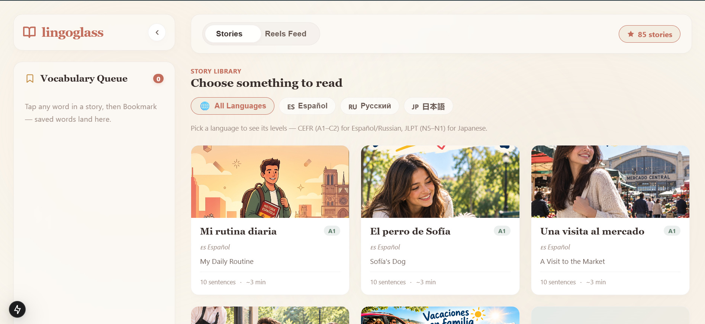

# lingoglass — a reading room of world stories

A calm, editorial reading app for graded language stories: Spanish, Russian (CEFR A1–C2)
and Japanese (JLPT N5–N1). Tap any word for its meaning, listen with native-device
voices, and keep a personal vocabulary queue — all in the browser.



## Features

- **85 graded stories** — 30 Spanish · 30 Russian · 25 Japanese folk tales & essays
- **Tap-to-define words** — every word is clickable, with grammar notes and the sentence translation
- **Japanese tokenization** — native [Sudachi](https://github.com/WorksApplications/Sudachi) morphology
  precomputed at build time (`scripts/precompute-ja.mjs` → committed
  `data/ja-tokens.generated.json`), with romaji readings and an offline English gloss dictionary
- **Read aloud** — sentence-by-sentence playback via the Web Speech API (Woman / Man / Auto voices, 0.5×–1.5×)
- **Vocabulary queue** — bookmark words; they persist in `localStorage` on the device
  (sign in to sync them across devices — see Configuration)
- **3 reading layouts** — side-by-side, line-by-line, interactive tap-to-reveal (persisted per device)
- **Optional Google sign-in** — sync bookmarks, reading progress, and resume position
  across devices via `POST /api/sync` (Auth.js + Turso; anonymous reading is unchanged)
- **Fully static reading** — all story pages prerendered at build time, no tracking
- **Warm editorial design** — Cream & Clay palette, system fonts only, no CSS frameworks

## Quick start

Requirements: Node.js 18+ · Python 3.10+ (only for Japanese tokenization)

```bash
npm install
pip install -r services/sudachi/requirements.txt  # Japanese tokenizer dict (~1 min, one-time)

npm run dev     # develop at http://localhost:3000
npm run build   # validate content + precompute JA tokens + production build (exit 0 = healthy)
npm start       # serve the production build on :3000
```

Python/Sudachi is only used LOCALLY at build time to regenerate the committed
`data/ja-tokens.generated.json`. If your interpreter isn't on `PATH` as
`python`/`python3`, point to it (see `.env.example`):

```bash
PYTHON=C:\Python314\python.exe
```

Without Python/Sudachi the build still succeeds — Japanese falls back to a
built-in regex splitter (no readings/lemmas).

### Optional: Google sign-in + cross-device sync

Without any env vars the app is exactly what it was before: anonymous,
localStorage-only, no network calls. To enable accounts:

1. Create an OAuth client in [Google Cloud Console](https://console.cloud.google.com/)
   (APIs & Services → Credentials → Create Credentials → OAuth client ID, type
   "Web application"). Add an authorized redirect URI for every origin you serve:
   `http://localhost:3000/api/auth/callback/google` for dev, plus your production
   URL (e.g. `https://your-site.netlify.app/api/auth/callback/google`).
2. Copy `.env.example` values into `.env.local`: `AUTH_GOOGLE_ID`,
   `AUTH_GOOGLE_SECRET`, plus `AUTH_SECRET` (generate with
   `openssl rand -base64 32` — required in production for session encryption).
3. Database: local dev needs nothing (falls back to gitignored
   `file:lingoglass.db`; create tables once with `npx drizzle-kit push`).
   Production: create a [Turso](https://turso.tech/) database
   (`turso db create lingoglass`), then set `TURSO_DATABASE_URL` (a `libsql://…`
   URL) and `TURSO_AUTH_TOKEN`, and push the schema against it
   (`TURSO_DATABASE_URL=… TURSO_AUTH_TOKEN=… npx drizzle-kit push`).
4. Restart `npm run dev`, open any page, and use "Sign in with Google" in the
   sidebar. Saving a word or reading a story on one device appears on another
   after sign-in; "Sign out" keeps everything on the device.

How sync works: `POST /api/sync` exchanges the client's full state (bookmarks
with deletion tombstones + per-story reading position) and returns the merged
result — last-write-wins, deletions propagate both ways, offline edits merge on
the next login. Rate/volume are bounded (≤1000 bookmarks, ≤500 progress rows
per request); unauthenticated calls get 401, unconfigured servers get 503.

## Project structure

```text
app/                 Next.js 15 App Router (library, reader, settings, sitemap)
  api/auth/          Auth.js handlers (Google sign-in; inert without env vars)
  api/auth-status/   capability probe (tells the UI whether auth/sync exist)
  api/sync/          POST: full-state bookmark + progress merge (401/503 guarded)
components/          reader (StoryText, WordPopover, AudioPlayer…), library, shell, auth
lib/                 stories parser · bookmarks · progress · sync · tts · jmdict gloss · settings
db/                  Drizzle schema (auth tables + bookmarks + progress, Turso/libSQL)
content/             85 story Markdown files (es/ru/ja) — see STORY-FORMAT.md
data/                ja-tokens.generated.json — precomputed Sudachi tokens (committed)
services/sudachi/    standalone Sudachi tokenizer, used LOCALLY at build time only
scripts/             content validator + JA precompute (both run on prebuild)
public/images/stories/  cover photos (optional; placeholders otherwise)
```

## Adding stories

Stories are data, not code — see **[STORY-FORMAT.md](STORY-FORMAT.md)** for the exact
Markdown format, then run `npm run build` to verify.

## Configuration

| Variable   | Default                 | Purpose                                    |
|------------|-------------------------|--------------------------------------------|
| `PYTHON`   | `python` → `python3`    | Python interpreter for the Sudachi script  |
| `SITE_URL` | `http://localhost:3000` | Canonical URL for `sitemap.xml`            |
| `AUTH_GOOGLE_ID` / `AUTH_GOOGLE_SECRET` | (unset) | Google OAuth client — sign-in hidden when unset |
| `AUTH_SECRET` | (unset) | Session encryption — required in production when auth is on |
| `TURSO_DATABASE_URL` / `TURSO_AUTH_TOKEN` | local `file:lingoglass.db` in dev | Sync database — `/api/sync` answers 503 when unset in production |

Reading, bookmarks, and preferences work with zero env vars (anonymous,
localStorage-only). Auth/sync are strictly additive.

## Scripts

| Command           | What it does                                      |
|-------------------|---------------------------------------------------|
| `npm run dev`     | Development server                                |
| `npm run build`   | Content validation + JA precompute + static production build |
| `npm start`       | Serve the production build                        |
| `npm run typecheck` | TypeScript check (`tsc --noEmit`)               |
| `npx vitest run` | Sync merge tests (`tests/sync.test.ts`) |
| `npx drizzle-kit push` | Create/update tables in the dev SQLite file (or Turso when env set) |
