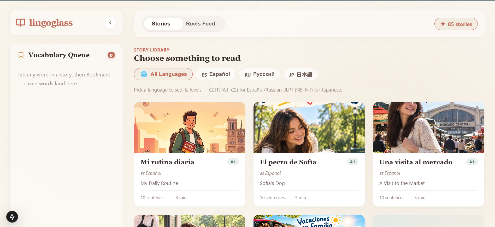

# lingoglass — a reading room of world stories

A calm, editorial reading app for graded language stories: Spanish, Russian (CEFR A1–C2)
and Japanese (JLPT N5–N1). Tap any word for its meaning, listen with native-device
voices, and keep a personal vocabulary queue — all in the browser.



## Features

- **85 graded stories** — 30 Spanish · 30 Russian · 25 Japanese folk tales & essays
- **Tap-to-define words** — every word is clickable, with grammar notes and the sentence translation
- **Japanese tokenization** — native [Sudachi](https://github.com/WorksApplications/Sudachi) morphology
  precomputed at build time (`scripts/precompute-ja.mjs` → committed
  `data/ja-tokens.generated.json`), with romaji readings and an offline English gloss dictionary
- **Read aloud** — neural narration per story (edge-tts) with sentence highlighting and word taps, falling back to the Web Speech API (Woman / Man / Auto voices, 0.5×–1.5×)
- **Vocabulary queue** — bookmark words; they persist in `localStorage` on the device
- **3 reading layouts** — side-by-side, line-by-line, interactive tap-to-reveal (persisted per device)
- **Fully static reading** — all story pages prerendered at build time, no tracking, no accounts, no database
- **Warm editorial design** — Cream & Clay palette, system fonts only, no CSS frameworks

## Quick start

Requirements: Node.js 18+ · Python 3.10+ (only for Japanese tokenization)

```bash
npm install
cp .env.example .env.local    # SITE_URL for the build (REQUIRED — build fails without it)
pip install -r services/sudachi/requirements.txt  # Japanese tokenizer dict (~1 min, one-time)

npm run dev     # develop at http://localhost:3000
npm run build   # validate content + precompute JA tokens + production build (exit 0 = healthy)
npm start       # serve the production build on :3000
```

Python/Sudachi is only used LOCALLY at build time to regenerate the committed
`data/ja-tokens.generated.json`. If your interpreter isn't on `PATH` as
`python`/`python3`, point to it (see `.env.example`):

```bash
PYTHON=C:\Python314\python.exe
```

Without Python/Sudachi the build still succeeds — Japanese falls back to a
built-in regex splitter (no readings/lemmas).

## Project structure

```text
app/                 Next.js 15 App Router (library, reader, settings, sitemap)
components/          reader (StoryText, WordPopover, AudioPlayer…), library, shell
lib/                 stories parser · bookmarks · progress · tts · story-audio · jmdict gloss · settings
content/             85 story Markdown files (es/ru/ja) — see STORY-FORMAT.md
data/                ja-tokens.generated.json — precomputed Sudachi tokens (committed)
services/sudachi/    standalone Sudachi tokenizer, used LOCALLY at build time only
scripts/             content validator + JA precompute (prebuild) + audio generator (manual)
public/images/stories/  cover photos (optional; placeholders otherwise)
public/audio/        neural narration: {slug}.{hash}.mp3/.json per story + manifest.json
```

## Adding stories

Stories are data, not code — see **[STORY-FORMAT.md](STORY-FORMAT.md)** for the exact
Markdown format, then run `npm run build` to verify.

## Story audio

`npm run audio:generate` synthesizes every sentence with **edge-tts** — Microsoft Edge's
read-aloud endpoint, free and key-less, driven by
[scripts/lib/edge_tts_synth.py](scripts/lib/edge_tts_synth.py) (`python -m pip install --user
edge-tts`) — and writes `public/audio/`: one MP3 per story plus a timing JSON whose
sentence/word offsets come from exact PCM byte lengths (never from player estimates), plus
`manifest.json`. Filenames embed a content hash so they can be cached immutably, and a
deploy serves them as plain static files: no keys, no Python and no ffmpeg on the server.

Per story: each sentence's MP3 (48 kbps CBR, 24 kHz mono) is cached next to its decoded PCM
and its word events under a voice+rate+text key in `.audio-cache/` (gitignored), so an
interrupted run resumes and an edited sentence alone re-synthesizes. The PCM pieces are
joined with 250 ms of silence between sentences and encoded **once**, CBR. Because 48 kbps
CBR is 288 MP3 bytes = 2304 PCM bytes = exactly one 48 ms frame, the voice's own
byte-derived word offsets and the assembled PCM timeline share one grid: no frame drift,
and one encoder pass instead of a per-sentence encode plus a remux. Afterwards `ffprobe` is
asked only to RECONCILE the finished file's length against the PCM that went in (it prints
the drift per story) — it never produces a timing value.

The default rate, `+25%`, is deliberately close to natural: the reader already has a
0.5×–1.5× speed control, and a second speed-up baked into the file would stack under it and
blur exactly the words a learner slows down for. Change it with `--rate` or `EDGE_TTS_RATE`;
the rate is part of every cache key and of the story hash, so changing it re-synthesizes
instead of silently reusing audio.

The reader fetches the manifest on mount and, when the story has audio, plays the MP3 and
highlights sentences from the timing JSON — the player badge then reads **Studio Audio**
(otherwise **Native Audio Sync**, the device voice). Speed control uses `playbackRate`;
seeking sets `currentTime` to the sentence's exact start.

Tapping a word plays just that word's audio. edge-tts says WHEN a word is spoken, never
where it sits in the text, so the generator recovers every word's character range with
`alignWords()` — a forward walk of the sentence, which is what keeps a repeated "no … no"
on its own occurrence — and stores plain UTF-16 spans. A tap is matched to a range by
position, and the MP3 seeks to that word's start and stops at its end. The voice segments
text its own way (Japanese boundaries are phrase-like), so tapping 桃 inside 「桃太郎」 plays
the phrase it was actually spoken in. A word that cannot be located gets no range and falls
back to the device voice; `--show-boundaries` prints the raw events with the range each one
aligned to.

Audio is an enhancement, never a requirement: a missing manifest, a missing entry, sentence
text that no longer matches the audio (story edited without regenerating), a timing JSON
written by an older schema version, or a playback error all fall back to the previous Web
Speech loop, per story.

**Privacy:** generating sends each sentence's text to Microsoft over HTTPS, at authoring time
only. Nothing at runtime talks to Microsoft — readers just fetch static files.

### Trying it without Python or the network: `--fixture`

`npm run audio:fixture` (or `npm run audio:generate -- --fixture`) runs the same pipeline —
same encoder, same silence gaps, same byte-exact timing math, same manifest — but each
sentence is a locally synthesized beep
([scripts/lib/audio-fixture.mjs](scripts/lib/audio-fixture.mjs)) whose word events carry
exactly what edge-tts sends: timing, no character offsets. Only ffmpeg is needed. Fixture
entries carry `"fixture": true` and the reader badges them **Studio Audio · test** instead of
passing beeps off as narration; the fixture voice hashes differently, so a later real run
regenerates rather than skipping, and a real run's files are never deleted by a fixture run.

Useful flags: `--lang es`, `--limit-per-level 1`, `--limit 3` (small batches — the first run
of a changed pipeline should be one), `--only lang/slug[,…]`, `--dry-run`, `--concurrency N`,
`--rate +25%`, `--show-boundaries [n]`. `npm run audio:clear` deletes the generated output.

## Configuration

| Variable             | Default                 | Purpose                                    |
|----------------------|-------------------------|--------------------------------------------|
| `PYTHON`             | `python` → `python3`    | Python interpreter — for the Sudachi script and for `audio:generate` (edge-tts) |
| `SITE_URL`           | `http://localhost:3000` | Canonical URL for `sitemap.xml` — **required in production** (the build fails without it) |
| `EDGE_TTS_RATE`      | `+25%`                  | Speaking rate for `npm run audio:generate` (`--rate` wins); authoring-time only, no key needed — see `.env.example` |
| `FFMPEG`             | `ffmpeg` on PATH        | Path to the ffmpeg binary. A winget/choco/Program Files install is found automatically when PATH does not know it yet (fresh terminal); `FFMPEG` overrides |

Reading, bookmarks, and preferences are anonymous and local-only
(`localStorage`). There are no accounts and no network calls for user data.

## Scripts

| Command           | What it does                                      |
|-------------------|---------------------------------------------------|
| `npm run dev`     | Development server                                |
| `npm run build`   | Content validation + JA precompute + static production build |
| `npm start`       | Serve the production build                        |
| `npm run typecheck` | TypeScript check (`tsc --noEmit`)               |
| `npm run lint` | ESLint (`next/core-web-vitals` + TS rules)        |
| `npm test` | Local-storage regression tests (`vitest run`) |
| `npm run audio:generate` | Neural story audio (authoring-time only; needs Python + edge-tts and ffmpeg — see `.env.example`). Supports `--lang`, `--limit-per-level`, `--limit`, `--only lang/slug`, `--rate`, `--dry-run`, `--concurrency`, `--show-boundaries` |
| `npm run audio:fixture` | Same pipeline, beep audio instead of edge-tts speech (ffmpeg only) — smoke-tests the reader. Add `-- --only lang/slug` etc. |
| `npm run audio:clear` | Deletes the regenerable `public/audio/` output (used to drop fixture beeps before committing) |
| `npm run deploy` | Uploads the built `out/` to Cloudflare Pages (see **Deploy** below) |

## Deploy

The site is a static export (`out/`) uploaded to Cloudflare Pages as the project
`lingoglass` → https://lingoglass.pages.dev. That project is a **direct upload**, not
Git-connected, so a push to GitHub runs CI only — deploying is a separate, deliberate step:

```powershell
$env:SITE_URL = "https://lingoglass.pages.dev"   # .env.local points at localhost, and the
                                                 # sitemap/robots bake this value in
npm run build                                    # validate + JA precompute + static export
npm run deploy                                   # wrangler pages deploy out --project-name=lingoglass
```

`npm run deploy` needs `wrangler` (install it globally, or change the script to
`npx --yes wrangler`) plus a one-time `npx wrangler login`, and it passes
`--commit-dirty=true` so an untracked scratch file can't stall a deploy behind a prompt.
CI on push/PR runs lint, typecheck, tests, content validation, `npm audit` and a build —
it never deploys.

Two things worth keeping in mind:

- **`public/audio/` is committed as ordinary Git blobs, deliberately not Git LFS.**
  `actions/checkout@v4` in CI, and any deploy box, does not fetch LFS objects by default,
  so an LFS-tracked MP3 would arrive as a 130-byte text pointer. The reader would then
  fall back to the device voice and look like it had a timing bug, when it never got audio.
- **`SITE_URL` is build-time, not runtime.** Building with the localhost value in
  `.env.local` produces a working site whose sitemap advertises localhost.

